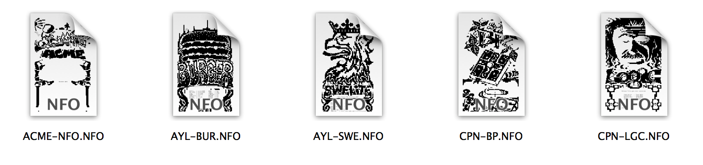
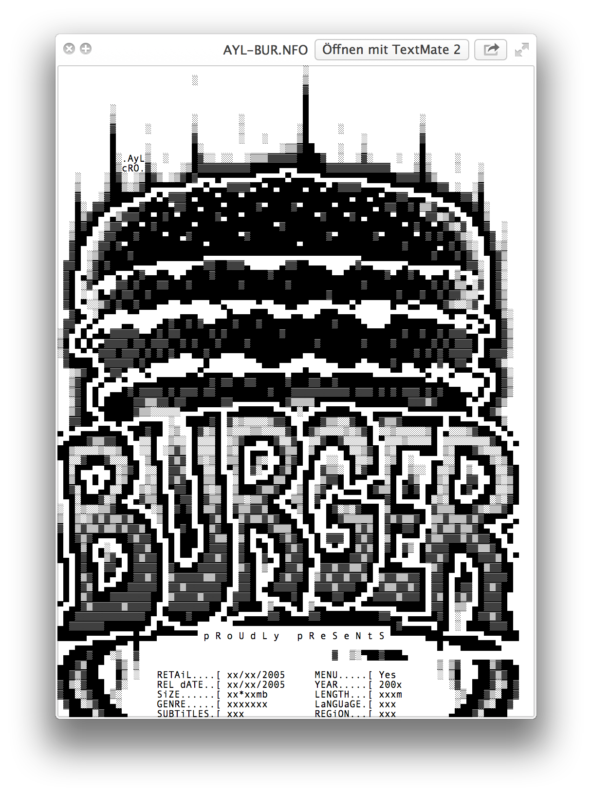

QuickNFO
==================

Mac OSX QuickLook Plugin for previewing NFO files

Uses libiconv to convert the nfo text to utf8 and then lets WebKit render the output. Seems to work well (at least for the few cases I have tested).

The current version supports preview and thumbnail generation. Rendering with HiDPI, like on retina displays, is also supported.

Installation
==================

Build the xcode project or download the [compiled plugin][download]. Then copy the file `QuickNFO.qlgenerator` to the path `Library/QuickLook` inside your home directory.

[download]:https://github.com/planbnet/QuickNFO/raw/master/QuickNFO.qlgenerator.zip

Examples
==================
###Thumbnails

###Preview

###Coverflow

